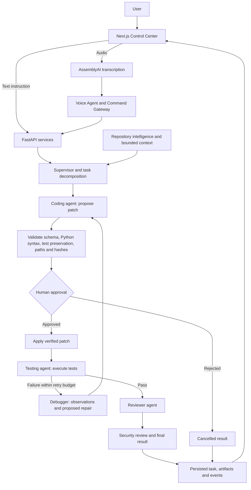

<div align="center">

# AgentOS

### Secure Autonomous AI Software Engineering Operating System

**An engineering instruction becomes a coordinated, inspectable workflow.**

Give AgentOS a natural-language or voice request. Its Supervisor coordinates specialized agents to inspect a repository, propose code changes, run tests, diagnose failures, and review results—with human approval before generated patches are applied.


[Get started](#getting-started) · [Architecture](#architecture) · [Demo](#demo) · [Security](#security) · [Contribute](#contributing)

</div>

---

## Why AgentOS?

Code suggestions are one part of software engineering. A useful change also needs repository context, a plan, executable tests, failure diagnosis, and review.

AgentOS brings those steps into a Supervisor-driven workflow. You can inspect the proposed patch, approve or reject it, follow execution events, and see the evidence behind the result.

> **Autonomy with checkpoints:** agents propose changes; AgentOS validates and executes them within configured policies; people retain control over patch approval.

## Key features

| Capability | What is implemented |
| :--- | :--- |
| **Supervisor orchestration** | Task decomposition, dependency-aware agent dispatch, and stateful LangGraph execution. |
| **Project creation** | Create a project directory, initialize starter metadata and optional Git, select it as the workspace, and submit an engineering instruction. Existing projects can also be connected. |
| **Repository context** | File inspection, symbol and dependency analysis, search, and bounded context selection for agent tasks. |
| **Code generation** | Structured file proposals, schema validation, bounded regeneration, and reviewable patches. |
| **Testing and recovery** | Execute supported test runners, report actual failures, and route failed tests through diagnosis, repair, renewed approval, and retesting. |
| **Code review** | A Reviewer agent assesses source and execution evidence before workflow completion. |
| **Voice control** | Browser audio capture, AssemblyAI transcription, command routing, and browser speech feedback. |
| **Human approval** | Approve or reject generated patches through the existing task/approval flow. |
| **Execution visibility** | Task status, WebSocket events and replay, workspace files, artifacts, and execution traces. |
| **Security controls** | Workspace confinement, sensitive-file checks, patch integrity verification, execution limits, authentication/RBAC, and audit logging. |

Implemented does not mean infallible: model output and review quality vary. See [current status](#current-status) for the verification boundary.

## Architecture

The Voice Agent handles interaction and dispatch. The **Supervisor owns engineering planning and execution**, with specialized agents operating through repository and tool services.



This diagram follows the coding workflow. LangGraph maintains execution state and approval checkpoints; failed or exhausted steps can terminate with a failure instead of a successful result.

Each repair requires another approval and actual retest. Original failed-test artifacts remain available after recovery; replacement mappings identify which retest resolves each failure. Infrastructure errors, invalid model output, and unsuccessful review cannot become a successful coding result.

Read-only requests run tests and report evidence, optionally followed by diagnosis. A completed diagnostic task can report failing tests; it does not mean those tests passed. Fix requests run tests → diagnosis → proposed repair → approval → apply → retest → review. Recovery is bounded by debug-attempt and subtask budgets, with at most two structured-generation attempts per proposal.

Strict diagnosis publishes captured execution/source observations, not free-form model root-cause claims. Repair advice remains explicitly unverified. Python proposal checks reject syntax errors, whitespace-only changes, removed existing assertions or test functions/fixtures, and removed imports of application modules present in context. These conservative checks can reject legitimate test refactors; they do not replace tests or human review.

Explore the implementation: [workflow graph](backend/app/workflows/multi_agent_workflow.py) · [Supervisor](backend/app/agents/supervisor.py) · [patch application](backend/app/code/patch/applier.py).

## Voice workflow

> “AgentOS, create a FastAPI URL shortener with authentication and tests.”

1. Open the voice control and allow microphone access on localhost or HTTPS.
2. Browser audio is sent to AssemblyAI for transcription.
3. The Voice Agent interprets the request and dispatches it through the Command Gateway.
4. Project creation selects the workspace; the Supervisor plans and delegates the engineering task.
5. Review and approve proposed patches. Tests, diagnosis, retesting, and review follow through the same engineering workflow used by text requests.
6. Follow task events in the UI; browser speech synthesis can announce feedback.

Voice requires an AssemblyAI API key and a browser with microphone capture support. Audio leaves the machine for transcription. Physical-microphone success and audible browser TTS were not verified in the latest recorded demo; real transcription of a synthetic spoken WAV was verified.

## Demo

**Recorded engineering result:** `gpt-oss:120b-cloud` completed the URL-shortener workflow through real AgentOS services, including approval, patch application, failed tests, debugging, retesting, and review.

Independent acceptance checks found defects that the first review missed. Follow-up instructions through AgentOS corrected them: the final generated project passed **6 tests** and **7 independent API checks**. This was a guided run, not a one-shot or unattended success. The configured local `qwen2.5-coder:3b` attempt did not complete the same task.

Read the [demo verification report](docs/hackathon-demo-report.md) for the exact model profile, evidence, and limitations. Its `tmp/` log and project paths refer to the verification machine; they are not bundled demo downloads.

> **Screenshots and walkthrough:** no repository-hosted screenshots or demo recording are available yet. A future walkthrough should show the instruction, approval diff, test/recovery events, and final artifact together.

## Tech stack

| Layer | Technology |
| :--- | :--- |
| Backend | Python, FastAPI, Pydantic, SQLAlchemy, Uvicorn |
| Orchestration | LangGraph with SQLite checkpoints; LangChain dependencies |
| Model execution | Ollama adapter with structured-response validation; additional provider adapters in `backend/app/llm/` |
| Frontend | Next.js 15, React 19, TypeScript, Tailwind CSS, Lucide icons |
| Voice | AssemblyAI transcription; browser MediaRecorder and SpeechSynthesis |
| Local persistence | SQLite database, filesystem artifacts, persisted task events |
| Verification | pytest, frontend lint/build, Node voice-endpoint tests, GitHub Actions workflow |
| Infrastructure files | Dockerfile, Compose, PostgreSQL/Redis configuration and integration code; deployment requires additional validation |

## Getting started

### Prerequisites

- **Python 3.11.14 or newer**, as declared in `pyproject.toml`.
- **Node.js 20** and npm, matching the frontend CI configuration.
- **Git** and a running **Ollama** service with the configured model available.
- An **AssemblyAI API key** if you want voice input. Text engineering does not require it.

The steps below use local SQLite and do not require Redis or PostgreSQL.

### 1. Clone and install the backend

```bash
git clone https://github.com/azharali8/AgentOS.git
cd AgentOS
python -m venv .venv
```

Activate the environment for your shell:

```bash
# macOS / Linux
source .venv/bin/activate
```

```powershell
# Windows PowerShell
.\.venv\Scripts\Activate.ps1
```

Then install the repository's dependencies:

```bash
python -m pip install --upgrade pip
python -m pip install -r requirements.txt
```

### 2. Configure AgentOS

Copy `.env.example` to `.env` in the repository root:

```bash
# macOS / Linux
cp .env.example .env
```

```powershell
# Windows PowerShell
Copy-Item .env.example .env
```

Edit `.env` for your machine:

```dotenv
LLM_PROVIDER=ollama
OLLAMA_BASE_URL=http://localhost:11434
OLLAMA_MODEL=llama3.2:latest

# Use an absolute path to the software project you want AgentOS to work on.
WORKSPACE_ROOT=/absolute/path/to/your/project

# Optional: required for real voice transcription.
VOICE_PROVIDER=assemblyai
ASSEMBLYAI_API_KEY=your_assemblyai_api_key_here
VOICE_TTS_PROVIDER=browser
```

On Windows, use a path such as `C:/Projects/MyApp`. Keep your target project separate from the AgentOS checkout. New projects can be created from the workspace UI instead of preparing their files manually.

With Ollama running, install and check the configured local model:

```bash
ollama pull llama3.2:latest
ollama list
```

This is the local model used for the September 22 engineering acceptance run; `.env.example` still defaults to `qwen2.5-coder:3b`. Neither model guarantees engineering-task completion. For the earlier guided cloud run, see the [cloud demo configuration](docs/hackathon-demo-report.md#reproducing-the-approved-cloud-profile). Cloud generation sends supplied task/code context to the provider.

The template disables authentication for local development and contains placeholder secrets. Keep this quickstart on localhost. Review authentication and secret configuration before exposing the service.

### 3. Run the backend

From the repository root, with the virtual environment active:

```bash
python -m uvicorn backend.app.main:app --host 127.0.0.1 --port 8000
```

Application startup initializes the database. The default SQLite database is `data/agentos.db` under the repository root.

### 4. Run the frontend

In another terminal:

```bash
cd frontend
npm ci
npm run dev -- --hostname 127.0.0.1 --port 3001
```

The frontend defaults to `http://localhost:8000`. To change it, set `NEXT_PUBLIC_API_URL` in `frontend/.env.local` before starting or building the frontend.

Open the [Control Center](http://localhost:3001) and use the development quick-access sign-in. Select or create a workspace, submit an instruction, then inspect pending approvals and task progress. The backend also exposes [API documentation](http://localhost:8000/docs) and a [liveness endpoint](http://localhost:8000/health).

### 5. Run checks

From the repository root:

```bash
python -m pytest backend/tests/ -q --tb=short
```

From `frontend/`:

```bash
npm run lint
node --test tests/*.test.cjs
npm run build
```

Backend regression tests explicitly select the mock model provider; passing regression tests alone does not establish real-model performance. The frontend's `npm test` script currently runs a build, so Node regression tests are listed separately above. These tests do not establish live voice quality.

<details>
<summary><strong>Docker and distributed infrastructure</strong></summary>

The repository contains a Dockerfile, Compose services, and PostgreSQL/Redis integration code. The checked-in Compose configuration has unset PostgreSQL credentials and volume paths, and its frontend service expects a prebuilt application. It is not a ready-to-run alternative to the local quickstart. Container deployment and distributed execution were not verified in the latest demo; configure and validate them separately.

</details>

## Project structure

```text
AgentOS/
├── backend/
│   ├── app/
│   │   ├── agents/          # Supervisor and specialized agents
│   │   ├── api/             # HTTP routes and API boundary
│   │   ├── code/            # Patch models, validation and application
│   │   ├── llm/             # Model adapters and structured output
│   │   ├── services/        # Tasks, workspaces, context and artifacts
│   │   ├── security/        # Policies, permissions and approval controls
│   │   ├── tools/           # Repository, terminal and test operations
│   │   ├── voice/           # Speech providers and command routing
│   │   └── workflows/       # Stateful execution graphs
│   └── tests/               # Unit and integration coverage
├── frontend/                # Next.js Control Center
├── docs/                    # Architecture audit and verification reports
├── .github/workflows/       # CI and security workflows
├── .env.example             # Local configuration template
└── requirements.txt         # Backend dependencies
```

## Security

**LLMs propose. AgentOS validates. Sensitive actions require controlled approval.**

- **Workspace boundaries:** path validation and sensitive-file checks constrain repository access and patch targets.
- **Patch integrity:** proposed content and original-file hashes are checked before application; changed originals cause rejection rather than an unchecked overwrite.
- **Approval checkpoints:** generated patches wait for approval, including repairs produced during recovery.
- **Bounded execution:** command allowlists, timeouts, output limits, patch budgets, and retry limits constrain tool use.
- **Test configuration isolation:** generated-project test processes exclude AgentOS settings such as its database URL and provider credentials.
- **Access and accountability:** authentication/RBAC, rate limiting, audit records, and artifact integrity checks are implemented.

These are application-level controls, not a claim that arbitrary generated code is isolated by a VM or container. Review generated patches and use a suitable environment for executing untrusted project code.

## Current status

**Active development. REAL AUTONOMOUS ENGINEERING LOOP WORKING END-TO-END: NO.** The September 22 local-model acceptance did not complete the requested creation → approval → test → diagnosis → repair → approval → passing retest → review loop. An earlier guided cloud demo succeeded, but does not establish current autonomous reliability.

| Latest engineering verification — September 22, 2026 | Result |
| :--- | :--- |
| Focused backend regression | 76 passed, 3 warnings |
| Full backend regression | 630 passed, 1 skipped, 4 warnings (298.52s) |
| Real `llama3.2:latest` endpoint creation | FAILED: test proposal invalid after bounded retries |
| Real diagnosis request | COMPLETED investigation; actual tests still failed with one setup error |
| Real repair request | CANCELLED during generation to finalize; no passing retest or review |
| Frontend / Voice / Live checks | Not rerun or modified in this phase; zero AssemblyAI calls |

These are dated local results, not live CI status or benchmarks. See the [engineering acceptance report](docs/engineering-loop-acceptance-report.md), [earlier guided demo](docs/hackathon-demo-report.md), and [CI workflow](.github/workflows/ci.yml). The final compact prompt, retry feedback and context/symptom filtering changes have regression coverage but have not completed another real acceptance run.

The local 3B model can still produce invalid code proposals and incorrect repair advice. Observations are evidence; repair advice is not a verified cause or fix. Repeatable real-model recovery, the physical voice experience, and deployment configurations remain unverified. No generated files were manually repaired and no task was manually marked successful in this phase.

## Contributing

Contributions that improve reproducibility, engineering reliability, or security are welcome. Start with a focused issue or pull request explaining the problem, expected behavior, and how to reproduce it. For code changes, include relevant tests, preserve approval and workspace boundaries, and run the checks above.

The repository does not yet include a dedicated contributing guide or a documented maintainer support policy.

## License

The repository contains an empty [LICENSE](LICENSE) file. No license terms have been specified; an open-source license cannot currently be stated.
